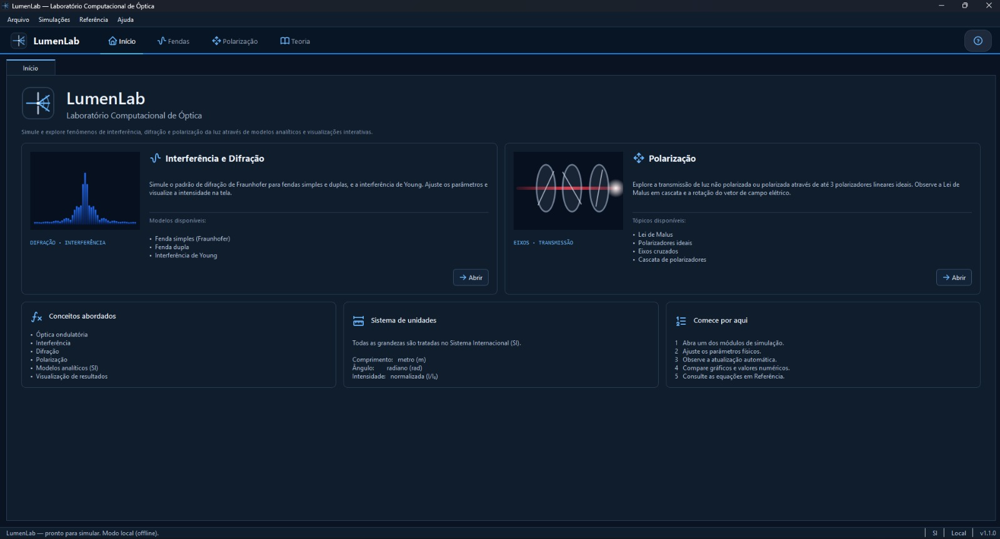
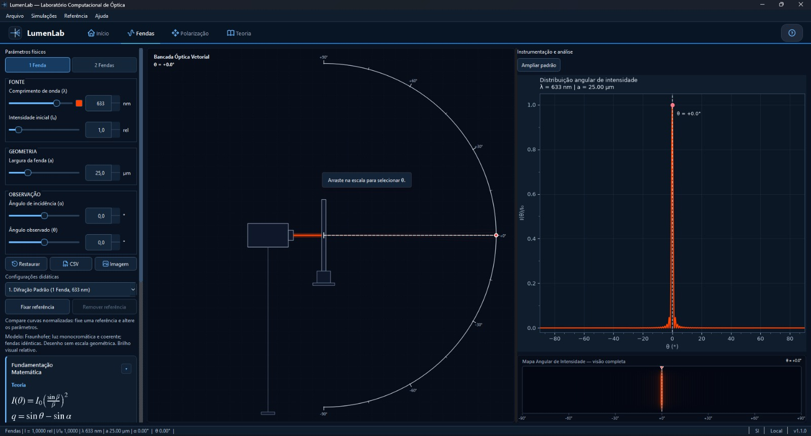
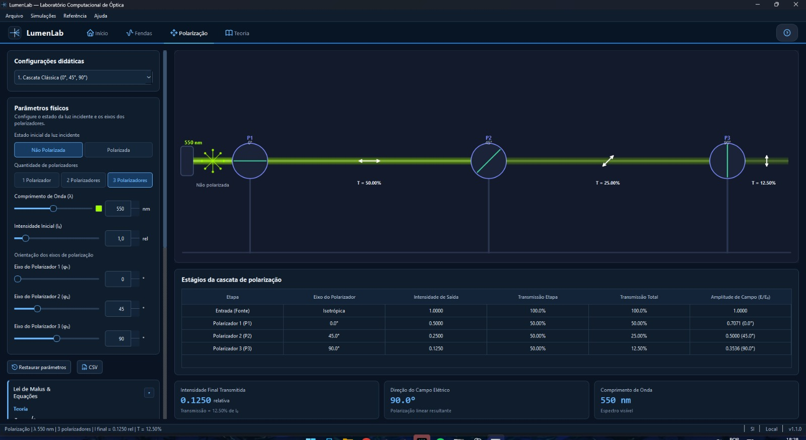
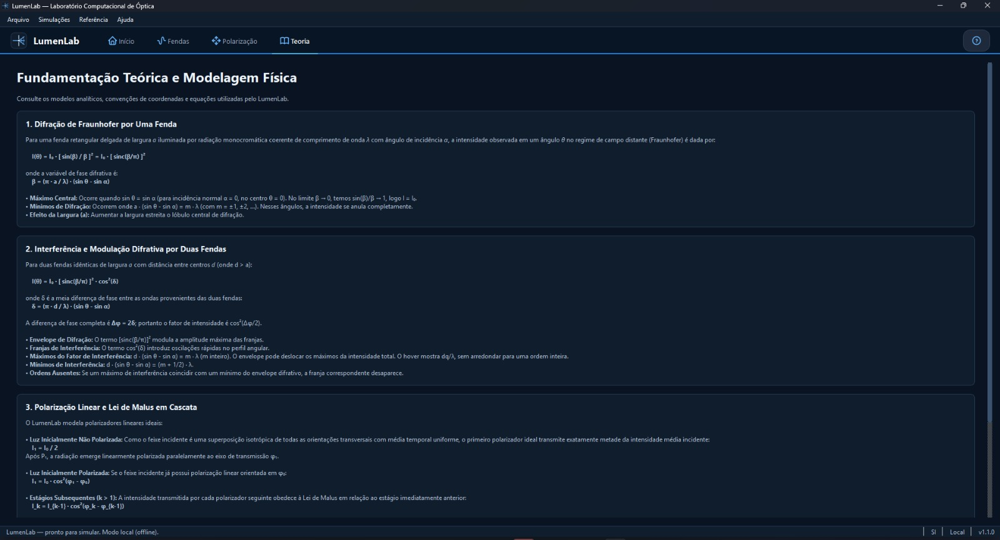
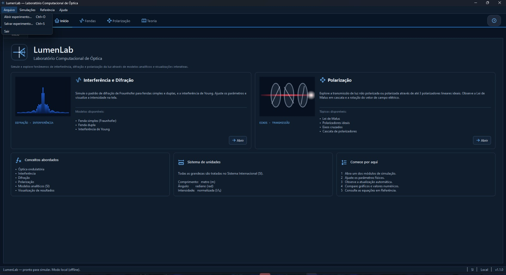
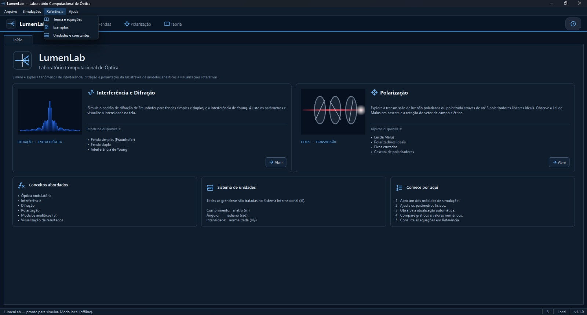
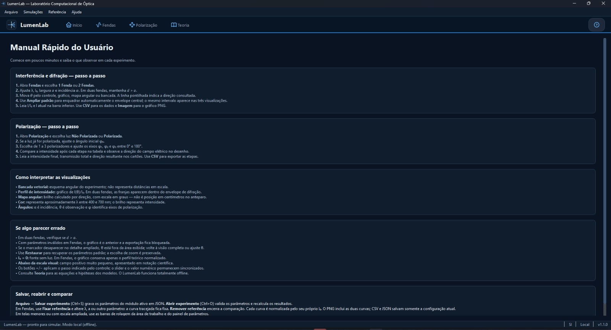

# Manual do Usuário — LumenLab

## 1. Introdução
O LumenLab é uma aplicação desktop educacional desenvolvida em Python para o estudo de fenômenos relacionados à luz, com foco especial em interferência, difração e polarização. O programa possui interface gráfica em português, foi projetado para funcionar de forma inteiramente offline e organiza suas funcionalidades em diferentes áreas de navegação, como Início, Fendas, Polarização, Teoria e Ajuda. Por meio da ferramenta, o usuário pode simular e realizar experimentos práticos envolvendo a passagem de luz por uma ou duas fendas, bem como analisar a interação luminosa através de até três polarizadores ideais. 

---

## 2. Requisitos para utilização
Antes de iniciar a execução do LumenLab, é fundamental garantir que o ambiente do computador esteja configurado com os requisitos adequados.

### 2.1 Requisitos de sistema
O programa foi projetado para operar no sistema operacional Windows. Para a sua execução, é necessário ter a linguagem Python na versão 3.11 (ou superior) instalada, além de dispor dos arquivos originais e das respectivas dependências do projeto na máquina local.

### 2.2 Tecnologias e bibliotecas utilizadas
A aplicação baseia-se em bibliotecas modernas que garantem o seu funcionamento eficiente. Destacam-se o PySide6, responsável pela construção e gerenciamento da interface gráfica; o NumPy, utilizado para o processamento dos cálculos numéricos do modelo físico; e o Matplotlib, que atua na geração e renderização dos gráficos.

---

## 3. Instalação do projeto
A preparação do LumenLab baseia-se na configuração de um ambiente virtual, o que garante que das dependências do projeto não interfiram em outras aplicações do seu sistema.

### 3.1 Criando um ambiente virtual
Para começar, abra o terminal do Windows diretamente na pasta raiz do projeto e crie o ambiente virtual executando o comando a seguir:
```bash
python -m venv .venv
```
Em seguida, ative esse ambiente para que o terminal passe a utilizá-lo: 
```bash
.venv\Scripts\Activate.ps1
```

### 3.2 Instalando as dependências
Com o ambiente virtual devidamente ativado, o próximo passo é baixar as bibliotecas necessárias para rodar a aplicação. Ainda no terminal, execute:
```bash
python -m pip install -r requirements.txt
```
Aguarde até que o processo de download e instalação seja finalizado. Assim que concluído, o ambiente do LumenLab estará totalmente configurado e pronto para ser executado.

---

## 4. Como executar o LumenLab
Para iniciar o programa, certifique-se de que o terminal ainda esteja aberto na pasta raiz do projeto e com o ambiente virtual ativado. Em seguida, digite o seguinte comando:
```bash
python main.py
```
Logo após a execução, a aplicação será devidamente carregada e a sua interface gráfica principal será exibida na tela. 

> **Observação:** Vale ressaltar que o LumenLab opera de maneira totalmente autônoma. Isso significa que, uma vez configurado e instalado, o software não exige qualquer tipo de conexão com a internet para funcionar ou realizar os experimentos. 

---

## 5. Conhecendo a interface
A interface do LumenLab foi projetada de forma intuitiva para facilitar o acesso do usuário aos diversos recursos da aplicação. A navegação é estruturada em cinco áreas principais, acessíveis diretamente pelo menu superior: a aba **Início**, que funciona como ponto de partida e seleção de módulos; a área de **Fendas**, dedicada às simulações de difração e interferência; o ambiente de **Polarização**, focado na passagem da luz por polarizadores ideais; a seção de **Teoria**, que reúne toda a fundamentação matemática por trás das simulações; e o painel de **Ajuda**, contendo instruções rápidas.

Todo o ambiente do sistema utiliza termos e unidades padronizados no português do Brasil. Além disso, a interface é dinâmica, adaptando automaticamente a exibição dos parâmetros físicos, painéis de resultados e gráficos de acordo com as necessidades específicas do experimento em andamento.



---

## 6. Módulo Fendas
O módulo Fendas permite estudar os fenômenos de difração e interferência utilizando uma ou duas fendas. Na interface principal, o usuário tem a liberdade de configurar diversos parâmetros do experimento, como a quantidade de fendas, o comprimento de onda, a largura da fenda, o ângulo de incidência, a intensidade inicial e o ângulo de observação. Quando a opção de duas fendas é selecionada, o parâmetro referente à separação entre elas também passa a ser utilizado ativamente na simulação. Após a configuração, o programa apresenta os resultados de maneira interativa por meio de diferentes recursos analíticos, incluindo uma representação da bancada experimental, mapas angulares, perfis visuais de intensidade e valores numéricos detalhados.



### 6.1 Unidades
Embora as grandezas utilizadas internamente pelo modelo físico sejam expressas no Sistema Internacional (comprimentos em metros e ângulos em radianos), a interface permite que o usuário trabalhe com unidades muito mais apropriadas e intuitivas para visualização, como nanômetros (nm), micrômetros ($\mu\text{m}$) e graus. O próprio LumenLab se encarrega de realizar automaticamente todas as conversões necessárias em segundo plano antes de executar os cálculos físicos.

### 6.2 Comprimento de onda
Para garantir a representação correta do espectro visível, o comprimento de onda configurado na interface deve estar estritamente dentro do intervalo válido de $400\text{ nm}$ a $700\text{ nm}$.

### 6.3 Modelo de uma fenda
Para as simulações envolvendo uma única fenda, a intensidade é calculada pelo seguinte modelo matemático:
$$I(\theta) = I_0 \left(\frac{\sin\beta}{\beta}\right)^2 = I_0 \cdot [\text{sinc}(\beta/\pi)]^2$$
em que a variável de fase é definida como $\beta = (\pi \cdot a / \lambda) \cdot (\sin\theta - \sin\alpha)$, considerando que $q = \sin\theta - \sin\alpha$. Além disso, para garantir a consistência nos cálculos numéricos no centro do padrão, o programa respeita o limite trigonométrico onde $\beta \to 0$, temos $\sin(\beta)/\beta \to 1$, logo $I = I_0$.

### 6.4 Modelo de duas fendas
Quando o experimento utiliza duas fendas, a modelagem matemática é expandida para:
$$I(\theta) = I_0 \cdot [\text{sinc}(\beta/\pi)]^2 \cdot \cos^2(\delta)$$
em que a diferença de fase é expressa por $\delta = (\pi \cdot d / \lambda) \cdot (\sin\theta - \sin\alpha)$. O uso dessa equação garante que o modelo preserva de forma simultânea tanto o efeito de interferência das ondas (gerado pelo termo cosseno) quanto o envelope de difração característico das fendas.

---

## 7. Módulo Polarização
O módulo Polarização é dedicado ao estudo da passagem da luz através de uma sequência de polarizadores ideais, permitindo a utilização simultânea de um a três elementos. Na interface de configuração, o usuário define as condições do experimento ao ajustar o estado e o ângulo inicial da luz (quando aplicável), a orientação do eixo de cada polarizador, o comprimento de onda e a intensidade inicial da fonte. Durante a simulação, os resultados e o comportamento do feixe luminoso são apresentados de forma detalhada e sequencial para cada etapa da travessia pelos polarizadores.



### 7.1 Luz não polarizada
Quando a simulação utiliza uma fonte de luz inicialmente não polarizada, o modelo assume que o primeiro polarizador transmite exatamente metade da intensidade inicial:
$$I_1 = \frac{I_0}{2}$$
A partir desse ponto de transmissão, o primeiro polarizador atua como um filtro linear, definindo o novo eixo de polarização da luz transmitida para os estágios subsequentes.

### 7.2 Luz polarizada
No caso de a luz incidente já ser inicialmente polarizada, a intensidade transmitida pelo primeiro elemento é calculada rigorosamente de acordo com a Lei de Malus:
$$I_1 = I_0 \cdot \cos^2(\varphi_1 - \varphi_0)$$
Para os polarizadores seguintes presentes na cascata, o modelo generaliza a equação, relacionando a intensidade de cada estágio ao que o antecede imediatamente: 
$$I_k = I_{k-1} \cdot \cos^2(\varphi_k - \varphi_{k-1})$$
Vale ressaltar que o modelo físico compreende a simetria do fenômeno, de modo que eixos equivalentes com uma diferença de $180^\circ$ produzem exatamente o mesmo resultado na transmissão da intensidade. 

---

## 8. Teoria e fundamentos físicos
A seção Teoria do LumenLab apresenta toda a fundamentação matemática que sustenta o programa. O principal objetivo dessa área é oferecer transparência e embasamento, permitindo que o usuário compreenda de forma clara a relação entre os parâmetros físicos configurados e os resultados finais apresentados pela aplicação. O escopo desta seção engloba conceitos fundamentais da óptica ondulatória, como interferência, difração, polarização, intensidade luminosa e comprimento de onda, além de grandezas geométricas, como os ângulos de incidência e observação, e formulações clássicas, a exemplo da Lei de Malus.



Para garantir o rigor e a consistência das simulações, o modelo analítico do programa apoia-se em um conjunto de hipóteses simplificadoras. Entre elas, pressupõe-se o uso de luz estritamente monocromática, garantindo uma iluminação coerente e uniforme ao longo de todo o experimento. Do ponto de vista dos componentes físicos, o modelo assume que as fendas são perfeitamente idênticas e que os polarizadores atuam de forma ideal. Por fim, o comportamento da luz é calculado considerando a ausência completa de perdas por efeitos secundários não ideais, como absorção adicional, reflexão ou dispersão óptica.

---

## 9. Visualização dos resultados
Após a configuração adequada dos parâmetros, o LumenLab processa e exibe os resultados dos experimentos combinando representações gráficas detalhadas e painéis numéricos. Para garantir uma interpretação precisa e didática, todos os gráficos gerados pelo sistema apresentam a identificação clara das grandezas físicas envolvidas, suas respectivas unidades de medida, legendas contextuais (quando necessárias) e o destaque para os valores mais relevantes da simulação. A dinâmica de exibição adapta-se ao tipo de experimento escolhido: no módulo Fendas, os resultados assumem o formato de mapas angulares, perfis de intensidade e dados numéricos diretos; já no módulo Polarização, a visualização é estruturada de forma sequencial, evidenciando o comportamento da luz e as variações de intensidade a cada etapa da sua passagem pela cascata de polarizadores.

---

## 10. Exportação dos resultados
O LumenLab dispõe de recursos integrados para a exportação dos resultados, permitindo que o usuário salve e registre suas análises de maneira prática. O sistema oferece suporte a diferentes formatos, dependendo da necessidade: o formato **CSV** é disponibilizado para a extração direta dos dados numéricos; o formato **PNG** é utilizado para salvar imagens fiéis das representações gráficas; e o formato **JSON** atua no armazenamento estruturado das configurações completas dos experimentos.



É fundamental ressaltar que a exportação só deve ser realizada após a validação completa da configuração do experimento. Como medida de consistência, caso o usuário insira uma entrada inválida durante o uso, o programa impede que resultados numéricos ou gráficos antigos sejam exportados como se estivessem associados aos novos parâmetros.

---

## 11. Validação dos parâmetros
Para garantir a coerência e a integridade física das simulações, o LumenLab executa verificações contínuas a fim de evitar configurações inválidas. O modelo matemático exige que variáveis como o comprimento de onda e a largura da fenda sejam estritamente maiores que zero, e que a intensidade inicial possua um valor finito e não negativo. Além disso, os ângulos devem estar contidos nos intervalos trigonométricos permitidos. Em casos específicos, como no modelo de duas fendas, o sistema também exige e verifica se a separação entre os centros das fendas é obrigatoriamente maior que a largura de uma única fenda.

A interface atua em conjunto com essas regras físicas: controles que não são aplicáveis à configuração selecionada no momento são dinamicamente ocultados ou desabilitados. Se o usuário informar um valor fora dos padrões aceitos, a aplicação foi projetada para lidar com a exceção de forma amigável, apresentando uma mensagem clara de alerta e validação sem que o programa seja encerrado abruptamente.

---

## 12. Possíveis problemas durante a execução

### 12.1 Python não encontrado
Caso o terminal exiba uma mensagem alertando que o comando `python` não foi reconhecido, é necessário verificar se a linguagem Python foi instalada corretamente na máquina e se o seu executável foi devidamente adicionado às variáveis de ambiente (PATH) do sistema operacional.

### 12.2 Biblioteca não encontrada
Se o sistema informar que um determinado módulo não foi localizado durante a execução, o problema geralmente está associado ao ambiente virtual. Certifique-se de que o ambiente virtual está ativado no terminal e, em seguida, execute novamente o comando de instalação para restaurar as bibliotecas:
```bash
python -m pip install -r requirements.txt
```

### 12.3 O programa não inicia
Caso a aplicação não abra, confirme se o terminal está operando exatamente na pasta raiz do projeto. Estando no diretório correto, tente iniciar o sistema mais uma vez através do comando:
```bash
python main.py
```
Se a dificuldade persistir, faça uma nova verificação para garantir que todas as dependências do projeto foram baixadas e instaladas com sucesso no passo anterior. 

---

## 13. Recomendações de utilização
Para garantir a obtenção de resultados consistentes e fidedignos durante as simulações, recomenda-se que o usuário confira atentamente os valores inseridos e utilize as unidades adequadas para cada grandeza antes de processar o experimento. Durante a navegação, é importante observar as mensagens de validação apresentadas pela aplicação, pois elas orientam sobre possíveis inconsistências físicas. Além disso, aconselha-se utilizar amplamente os gráficos gerados para visualizar o comportamento da intensidade luminosa, comparando sempre os resultados numéricos obtidos com a fundamentação matemática detalhada na seção Teoria. Por fim, ao realizar a exportação, o usuário deve sempre se certificar de que os arquivos salvos correspondem exatamente à configuração ativa no momento.

---

## 14. Considerações finais
O LumenLab foi idealizado e desenvolvido como uma ferramenta educacional robusta, destinada a auxiliar no estudo e na compreensão de fenômenos ópticos complexos por meio de uma interface gráfica amigável e interativa. A aplicação integra com sucesso a representação matemática dos fenômenos abordados, a flexibilidade na configuração dos parâmetros físicos e a visualização dinâmica dos resultados, permitindo que o usuário explore uma ampla gama de situações práticas relacionadas à interferência, difração e polarização da luz.

Para usufruir de todo o potencial do programa e garantir o seu funcionamento adequado, recomenda-se que as etapas descritas neste manual sejam seguidas fielmente na ordem apresentada: iniciando pela preparação do ambiente e instalação das dependências, seguindo para a execução do software e culminando na realização analítica dos experimentos em seus respectivos módulos.



